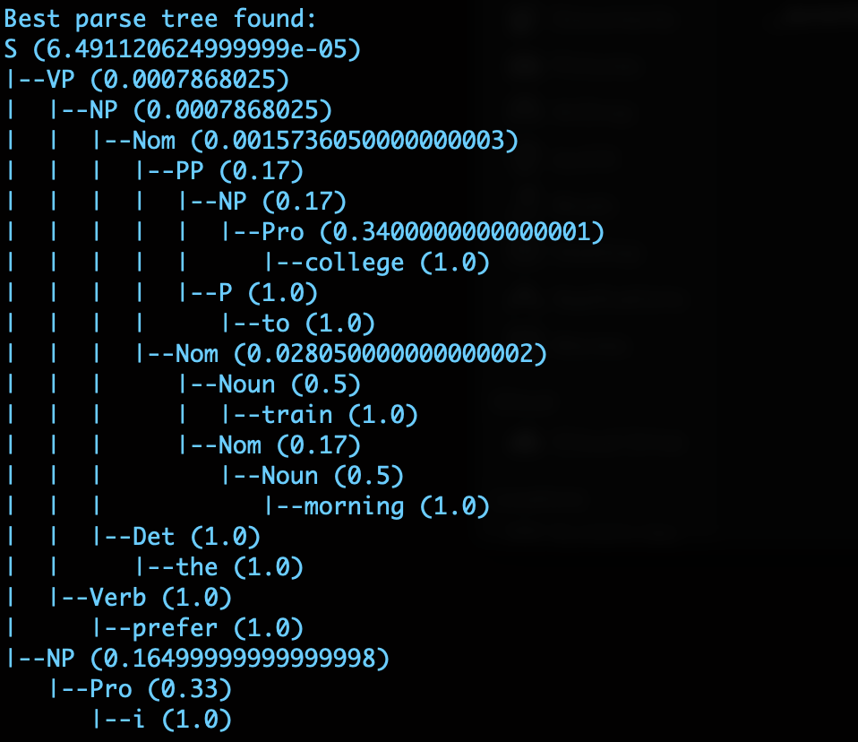

# nlp-cky-PCFG
This repository contains an implementation of the CKY parsing for English. (NLP)

Parsing or part of speech tagging in Natural Language Processing helps uncover the inherent 
structure of a language. Modelling a sentence to its possible tag sequence is the primary focus of 
parsing. However, words in English and other languages can take several possible parts of speech. 
This inherent ambiguity is a major challenge for the tagging models. They tend to produce multiple 
parses of the same sentence with potentially different meanings. One way to overcome this ambiguity 
is to build a probabilistic model to give a distribution over the possible derivations of a sentence 
and select the one with the highest probability. This is the key idea in probabilistic context free 
grammars (PCFGs). These grammars extend the definition of a traditional CFG to define the aforementioned 
distribution over the possible parse trees of a sentence.

This implementation presents the code to find the the best probabilistic parse tree given grammar rules 
in CNF and an input sentence to test.

Sample Input :
"I prefer the morning train to College"

Command :
python3 test.py grammar.cfg "I prefer the morning train to College"

Sample Output :

